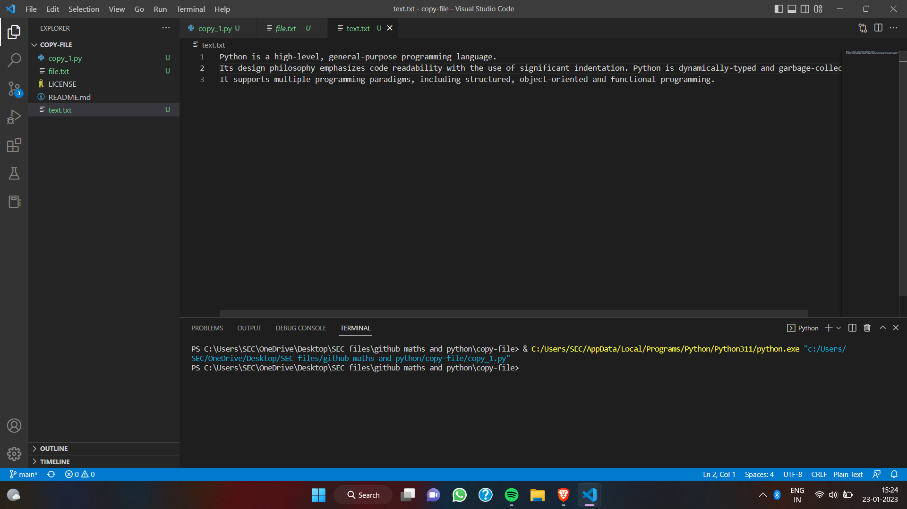
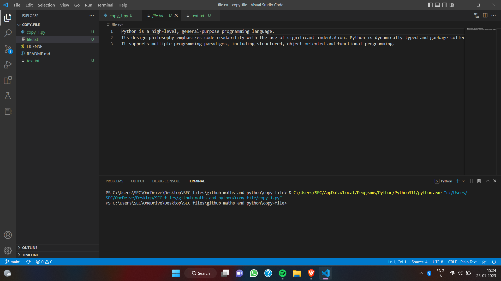

# copy-file
## AIM:
To write a python program for copying the contents from one file to another file.
## EQUIPEMENT'S REQUIRED: 
PC
Anaconda - Python 3.7
## ALGORITHM: 
#### Step 1:import sys
#### Step 2: initially make count = 0 
#### Step 3: open the content file using command line arguments.
#### Step 4:  by using for loop name the function as "line"
#### Step 5: split the line using .split
#### Step 6: split the line using .split

## PROGRAM:
```
#developed by : yoheshkumar R.M
#register number : 22008459
```
```
with open ("text.txt") as fp:
  with open("file.txt","w") as fp1:
    line= fp.read()
    fp1.write(line)
```
### OUTPUT:





## RESULT:
Thus the program is written to copy the contents from one file to another file.
